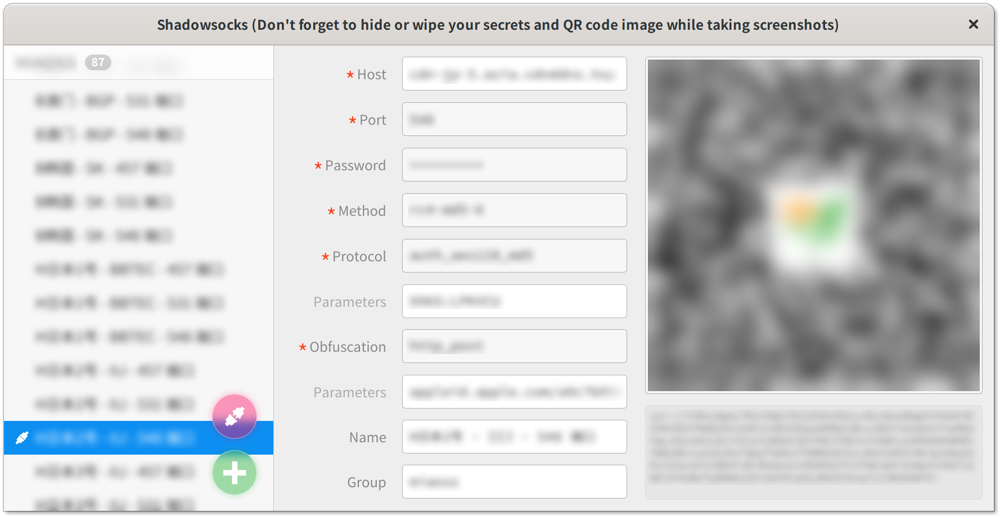
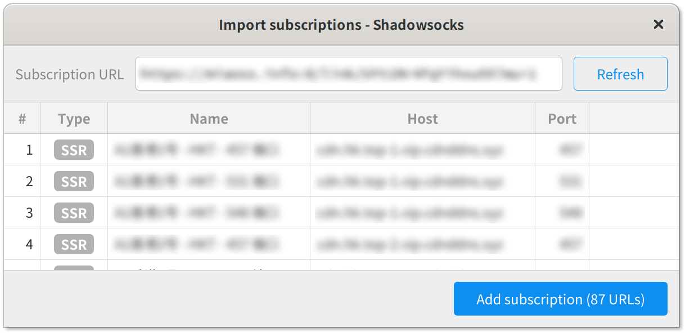
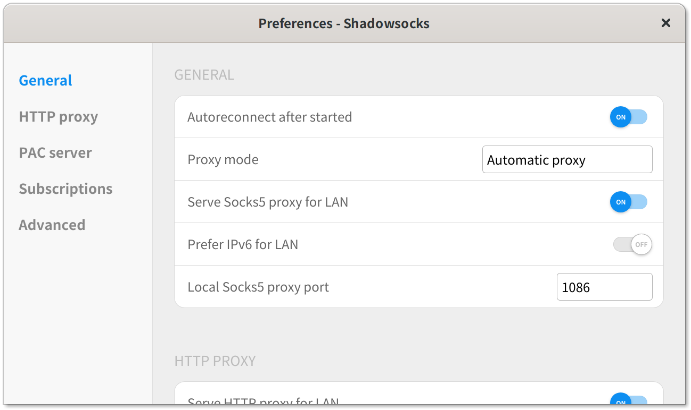

# Project Introduction

This is a project concerntrate on the front-end of ShadowsocksR in GNOME, 
as a rewrite and upgrade of the previous abandon project `electron-ssr`.

The design and architecture of the app is based on electron and mewjs, 
UI part is all based on my own front-end framework, not the popular vue
which is used in `electron-ssr`.

# How to Run

* Place the electron under the directory `data/electron`
* Place the mewjs under the directory `data/mewjs`
* Execute command `bin/ssr-gui`

# Differences from `electron-ssr`

1. Program part and GUI part is based on my own code framework
2. All the GUI is totally redesigned from strach
3. Fix the bug for `second-instance` on linux platform
4. Add IPv6 supports. (Experimental)
5. Upgrade the electron supports to 7.1.9 (make the UI supports backdrop-filter)
6. Change the default language to English for some buggy linux environments. 
(although I am a Chinese, the linux is not very user-friendly to us sometimes)
7. Make the tray not essential for the app, which is not default supported in 
the new GNOME 
8. Tidy the logs for the app
9. Update the GFWList according to the original repo

# More works to do

1. Replace the `electron` to `libcef`
2. Replace the python based shadowsocks to pure JS version or C++ version
3. Add QRCode scanning supports
4. Add QRCode PNG saving supports
5. Fix some bugs on the `ui-sheet-view`
6. Make custom GNOME extensions to replace the buggy tray part from electron

# FAQ

1. Where to get the mewjs?
   Download from [Mewchan Website](https://www.mewchan.com/dists.mhtml)
2. Will it support Windows and macOS?
   Maybe, most part of the codes are compatible.
3. Why mewjs?
   Traditional electron app extends the browser contexts with node supports, but
   each context will own a unique global object which makes the business logic
   much more complex for IPC communications. I prefered to use B/S architecture 
   to make the business logic all in the mewjs.
4. Why not vue?
   Most modern front-end framework has a very confusing behavior. The codes 
   could not be run directly in the browser! What I am writing is JS, HTML, CSS, 
   and etc, and you told me that there is no possibility to run directly in the 
   browser. They must be compiled, or packed by a special NPM module command, 
   which does not make sense. To my opinion, the web part should be run directly
   in a static web server. There should exists a method for programmers pack codes 
   to accelerate and optmize, but it should not be essential.

# Releases

Maybe I will release some packed `.tar.gz` files latter. I don't like deb or rpm
file, sometimes not suitable for all linux.

# Screenshots

